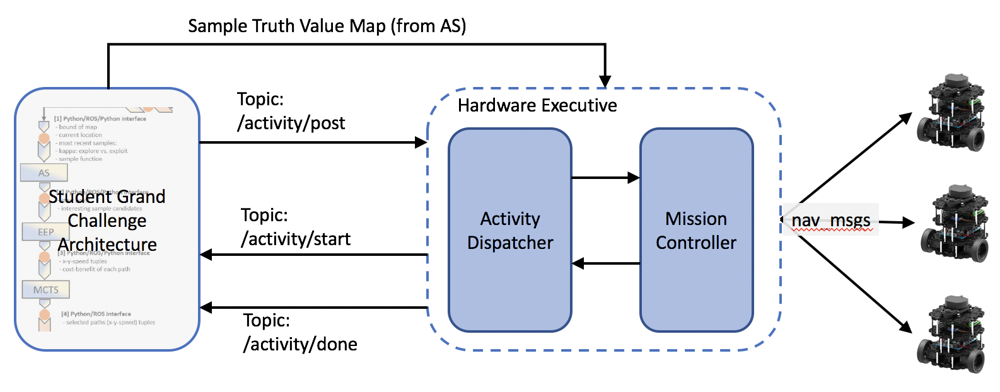

# ROS Mission Controller
Marlyse Reeves, Sarah Keren - Spring 2019


## Architecture
The diagram below depicts the ROS architecture for the 2019 Cognitive Robotics Grand Challenge. 



The hardware executive interfaces with the planning architecture (student designed and implemented) with the hardware (Turtlebot3 Burgers). 

The activity dispatcher receives activity requests from the planning component. When the activities dispatcher starts dispatching an activity, it publishes an ActivityStart.msg on the topic `activity/start`. When the activity is completed, it send an ActivityDone.msg on the topic `activity/done` with the sampled values.

The mission controller interfaces with the hardware through the MoveBase navigation node. It receives requests to execute activities on specific turtlebots from the activity dispatcher. The mission contoller also requires a sample truth value map to generate "sampled" values when the Turtlebots reach sampling locations. 

Its important to note that this framework (as of right now) is *synchronous* between agents. That is, the activity dispatcher waits until all agents have finished their individual plans before reporting that the overall activity is complete and sending along the sample values.

## Launching the Nodes

Both the activity dispatcher and the mission controller remain running for the duration of the mission. Thus, you should start these nodes first. Since the mission_controller creates servers that connect to Turtlebots and wait for activities, you should start this node first.

### Mission Controller
To start the `mission_controller` node:

```
rosrun mission_controller mission_contoller _agents:="[tb3_4, tb3_2]"
```
The mission controller node takes a single parameter `_agents` which is a list of the namespaces of the Turtlebots that are active in the mission. This list sets the ordering of Turtlebots. For example, `tb3_4` will attempt to execute the first plan in the list of plans in the ActivityRequest.msg. If the parameter list is empty or not included, the mission_controller will assume only one Turtlebot is running and it does not have a namespace.

Once the mission controller node is running, you can query the "agents" parameter from the command line:

```
rosparam get /mission_controller/agents
```


or from Python code (it will return a list of strings or an empty list):

```
rospy.get_param("/mission_controller/agents")
```

### Acticity Dispatcher
To run the `activity_dispatcher` node:

```
rosrun mission_controller activity_dispatcher
```


## Interface

For all the message discussed below, look at the .msg files in msg folder for the contents of each message.

### Send an activity
To send activity to the executive, publish on the `activity/post` topic. The message type to send is an ActivityRequest.msg. The top level structure of this message can be thought of as a list of plans, one for each robot where each plan is a list of waypoint tuples. Look in the `test` folder to see an example message.

### Receive activity updates
When the activity dispatcher send plans to the mission controller for execution, it will publish a ActivitStart.msg message to the `activity/start` to alert the planning components that an activity has started.

When an activity as been completed (i.e. all agents have finished their respective plans), the activity dispatcher will publish a message to the `activity/done` topic with the sampled values for each turtlebot (in a list that is ordered according to the `mission_controller/agents` parameter. 
